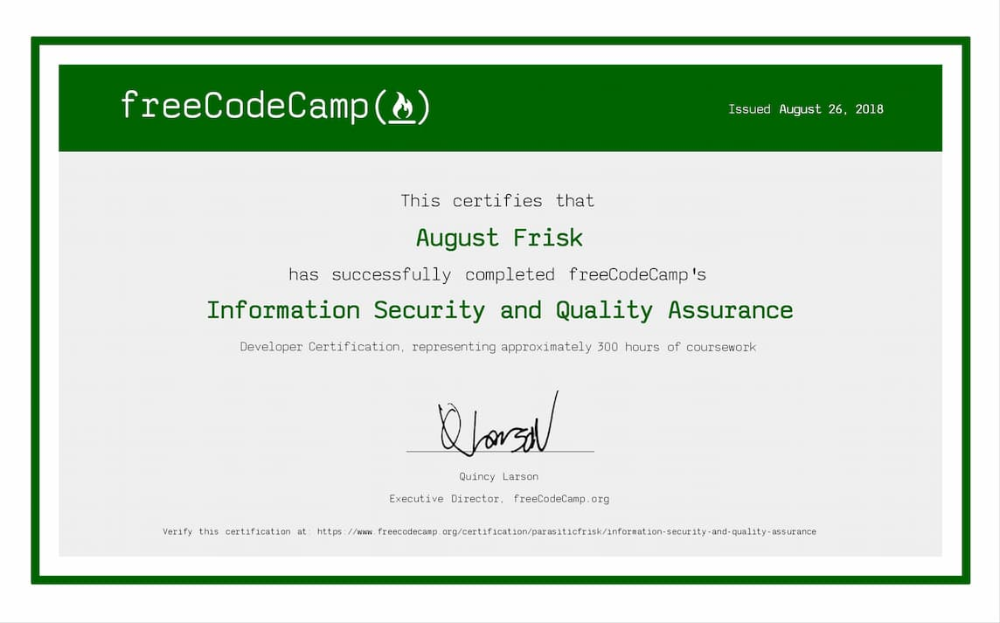

 

 

As part of this certification, the following projects met each of the indivudual project requirements and passed all of freeCodeCamp's automated test suites:

 

- [Metric/Imperial Converter](https://cumbersome-band-dead.glitch.me/)
- [Issue Tracker](https://outgoing-emphasized-cheque.glitch.me/)
- [Personal Library](https://mini-buttered-darkness.glitch.me/)
- [Stock Price Checker](https://jungle-frill-traffic.glitch.me/)
- [Anonymous Message Board](https://tidy-lush-society.glitch.me/)